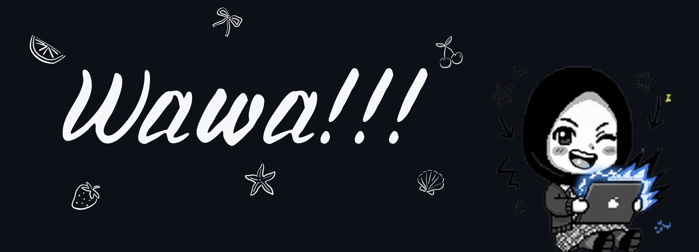

  

---

## 🌸 Know About Me
<table>
<tr>
<td width="55%">

### Hey there! I'm Wahidah 👋
I'm a **Software Engineering (RPL)** student with a love for clean UI and cozy code. By day, I'm learning web development. By night, I'm probably debugging CSS for 3 hours straight. 

When I'm not coding, you'll find me exploring UI/UX design or collecting aesthetic Pinterest boards. ✨

</td>
<td align="center">

</td>
</tr>
</table>

---

## 🛠️ Tech Stack

  

---

## 📊 GitHub Status

  
  

---

## 🔗 Connect with Me

  
  

---

*"Code is never finished. It only becomes slightly less terrible over time."* 💖

<!--
**wahidahmumtazzah/wahidahmumtazzah** is a ✨ _special_ ✨ repository because its `README.md` (this file) appears on your GitHub profile.

Here are some ideas to get you started:

- 🔭 I’m currently working on ...
- 🌱 I’m currently learning ...
- 👯 I’m looking to collaborate on ...
- 🤔 I’m looking for help with ...
- 💬 Ask me about ...
- 📫 How to reach me: ...
- 😄 Pronouns: ...
- ⚡ Fun fact: ...
-->
